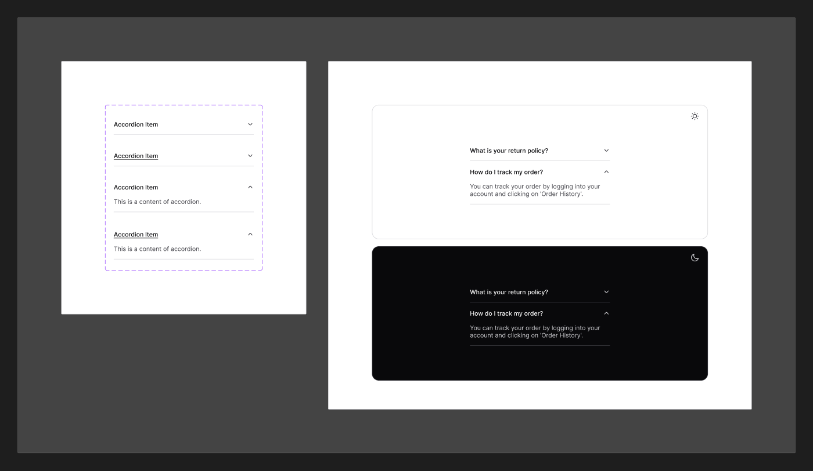

# Accordion

[← Components](./README.md) · Code: [`@mijn-ui/react-accordion`](../../packages/components/accordion)

A vertically stacked set of expandable sections.



## Figma variants

| Property | Values |
|----------|--------|
| `Intent` | `outline`, `plain`, `solid` |
| `Size` | `sm`, `md`, `lg` |
| `State` | `enabled`, `hovered`, `disabled` |
| `isOpened` | `false`, `true` |
| `isHovered` | `false`, `true` |

## Anatomy (code)

Compound component built on Radix Accordion:

```tsx
import {
  Accordion, AccordionItem, AccordionTrigger, AccordionContent,
} from "@mijn-ui/react-accordion"

<Accordion type="single" collapsible>
  <AccordionItem value="item-1">
    <AccordionTrigger>Section title</AccordionTrigger>
    <AccordionContent>Section body</AccordionContent>
  </AccordionItem>
</Accordion>
```

Exposed types: `AccordionProps`, `AccordionItemProps`, `AccordionTriggerProps`,
`AccordionContentProps`, `AccordionVariantProps`, `AccordionSlots`.

- **`Intent`** → `variant` prop (`outline` / `plain` / `solid`).
- **`Size`** → `size` prop (`sm` / `md` / `lg`).
- **`State` / `isHovered` / `isOpened`** are runtime states (`:hover`,
  `disabled`, open/closed) — not props.

Open/close animation uses the `--animate-accordion-open` / `-close` tokens from
[`theme.css`](../../packages/core/src/theme.css).
