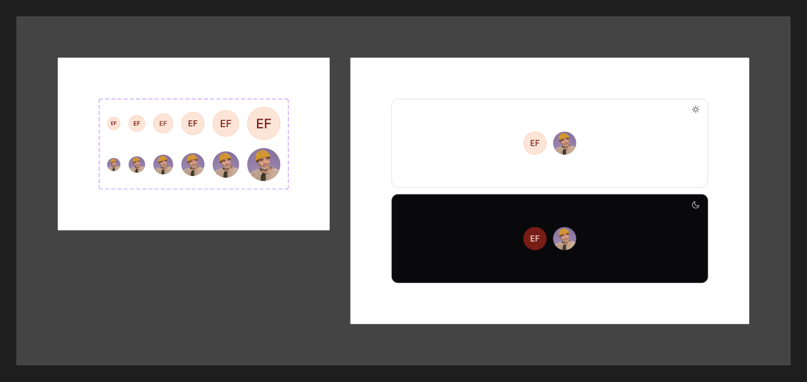

# Avatar

[← Components](./README.md) · Code: [`@mijn-ui/react-avatar`](../../packages/components/avatar)

Represents a user or entity with an image, with a text fallback.



## Figma variants

| Property | Values |
|----------|--------|
| `Size` | `2xs`, `xs`, `sm`, `md`, `lg`, `xl` |
| `hasImage` | `false`, `true` |

When `hasImage=false`, the fallback (initials or icon) is shown.

## Anatomy (code)

```tsx
import { Avatar, AvatarFallback, AvatarGroup } from "@mijn-ui/react-avatar"

<Avatar size="md" src="/user.png" alt="Jane">
  <AvatarFallback>JD</AvatarFallback>
</Avatar>

<AvatarGroup>
  <Avatar src="/a.png" />
  <Avatar src="/b.png" />
</AvatarGroup>
```

Exposed types: `AvatarProps`, `AvatarFallbackProps`, `AvatarGroupProps`,
`AvatarVariantProps`, `AvatarGroupVariantProps`, `AvatarSlots`, `AvatarGroupSlots`.

- **`Size`** → `size` prop (`2xs` … `xl`).
- **`hasImage`** is runtime — driven by whether the image loads; on failure the
  `AvatarFallback` renders.
- **`AvatarGroup`** stacks multiple avatars with overlap.
