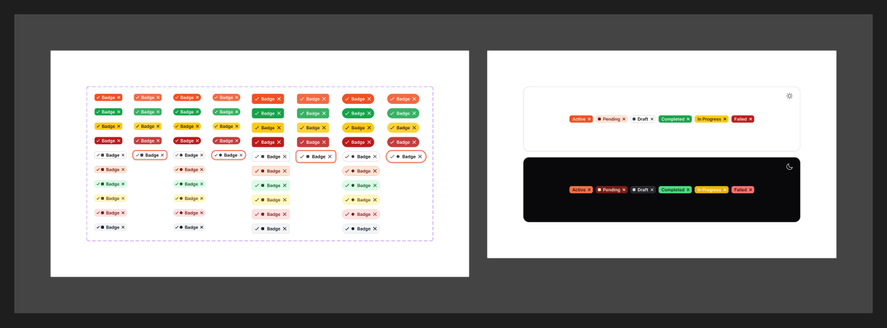

# Badge

[← Components](./README.md) · Code: [`@mijn-ui/react-badge`](../../packages/components/badge)

A small label for status, counts, or categories.



## Figma variants

| Property | Values |
|----------|--------|
| `Type` | `Solid`, `Tonal`, `Modern` |
| `Tone` | `Default`, `Brand`, `Success`, `Warning`, `Error`, `Categorial` |
| `Shape` | `Default`, `Pill` |
| `Size` | `Small`, `Large` |
| `State` | `Default`, `Hovered`, `Focused` |

This is the richest variant matrix in the set (60 combinations): three visual
styles × six tones × two shapes × two sizes.

- **`Type`** — fill style: `Solid` (filled), `Tonal` (subtle bg + colored text),
  `Modern` (outline / minimal).
- **`Tone`** — color role; maps to Foundation roles `brand` / `success` /
  `warning` / `danger` (Figma `Error`) / neutral (`Default`), plus `Categorial`
  for the categorical palette. See [Foundation → Colors](../foundation/colors.md).
- **`Shape`** — `Pill` uses `radius/full`; `Default` uses the standard radius.

## Anatomy (code)

```tsx
import { Badge } from "@mijn-ui/react-badge"

<Badge variant="solid" size="sm">New</Badge>
```

Exposed types: `BadgeProps`, `BadgeVariantsProps`, `BadgeSlots`. The code exposes
`variant` and `size` props; tone/shape map onto the color role + radius utilities.
