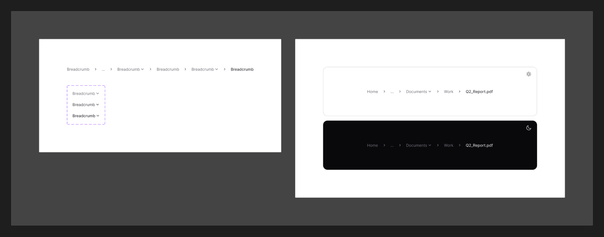

# Breadcrumb

[← Components](./README.md) · Code: _no dedicated package in this repo_

Shows the user's location in a navigational hierarchy.

## Figma variants

| Property | Values |
|----------|--------|
| `State` | `Default`, `Hovered`, `Active` |

`State` applies per-item: `Default` for ancestor links, `Hovered` on pointer
over, `Active` for the current (last) item.

## Status

There is **no `@mijn-ui/react-breadcrumb` package** in
[`packages/components/`](../../packages/components/). To build this today,
compose links + a separator icon (e.g. the `arrow-right-01` /
`arrow-right-02` icon from [Iconography](../foundation/iconography.md)) using the
neutral foreground roles:

- Links → `text-fg-secondary`, hover → `text-fg-primary`
- Current item → `text-fg-primary`, non-interactive
- Separator → `text-fg-tertiary`

> If a breadcrumb package is added later, update this page with its anatomy.
