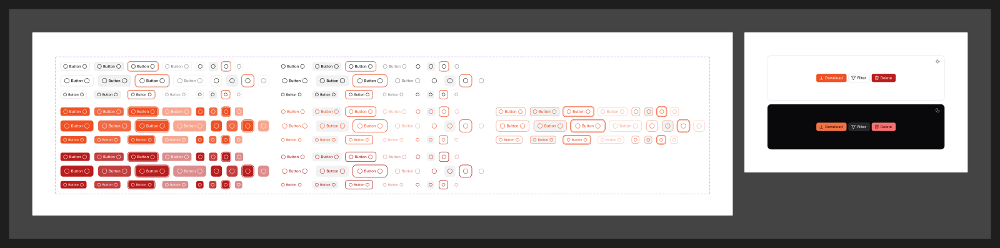

# Button

[← Components](./README.md) · Code: [`@mijn-ui/react-button`](../../packages/components/button)

Triggers an action. The most variant-rich control (168 combinations).



## Figma variants

| Property | Values |
|----------|--------|
| `Type` | `Default`, `Default Plain`, `Brand`, `Brand Plain`, `Brand Outline`, `Error`, `Error Plain` |
| `Size` | `Small`, `Default`, `Large` |
| `State` | `Default`, `Hovered`, `Focused`, `Disabled` |
| `Icon Only` | `false`, `true` |

- **`Type`** combines a color role (`Default` neutral / `Brand` / `Error`→danger)
  with a fill style:
  - _solid_ (e.g. `Brand`) — filled background
  - _Plain_ — text/ghost, no background until hover
  - _Outline_ — border + transparent fill (`Brand Outline`)
- **`State`** — runtime: `Hovered` (`:hover`), `Focused` (shows the
  [focus ring](../foundation/focus-ring.md)), `Disabled` (`disabled` attribute).
- **`Icon Only`** — square button sized for a single icon (no label).

## Anatomy (code)

```tsx
import { Button } from "@mijn-ui/react-button"

<Button variant="brand" size="default">Save</Button>
<Button variant="brand-outline" size="sm">Cancel</Button>
<Button variant="default-plain" iconOnly aria-label="More">
  <Icon name="more-vertical" />
</Button>
```

Exposed types: `ButtonProps`, `ButtonBaseProps`, `ButtonVariantProps`,
`ButtonSlots`.

- **`Type`** → `variant` prop. Figma `Error` ↔ code `danger` color role.
- **`Size`** → `size` prop (`sm` / `default` / `lg`).
- Focus uses the brand [focus ring](../foundation/focus-ring.md); colors come
  from the `brand` / `danger` roles in [Colors](../foundation/colors.md).
