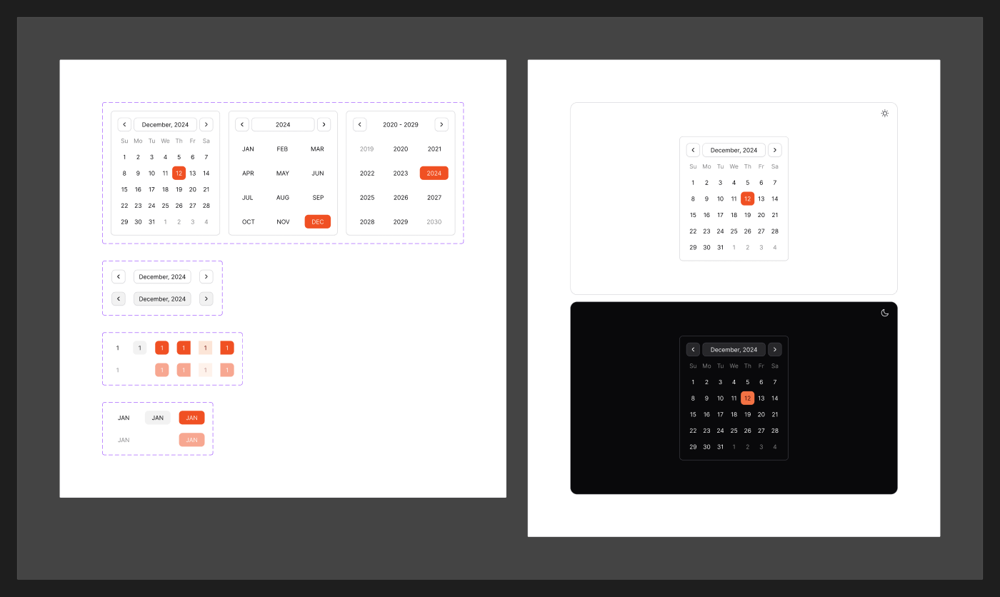

# Calendar

[← Components](./README.md) · Code: [`@mijn-ui/react-calendar`](../../packages/components/calendar)

A date grid for selecting days, months, and years.



## Figma variants

| Property | Values |
|----------|--------|
| `Type` | `Day`, `Month`, `Year`, `Main`, `Previous`, `Next` |
| `State` | `Default`, `Hovered`, `Selected`, `Start`, `Mid`, `End` |
| `isEnabled` | `false`, `true` |
| `isHovered` | `false`, `true` |

- **`Type`** — the cell/view kind: individual `Day`/`Month`/`Year` cells, the
  `Main` grid, and `Previous`/`Next` (out-of-month or adjacent cells).
- **`State`** — selection states for range selection: `Start` / `Mid` / `End`
  shape the highlighted band across a date range; `Selected` is a single date.
- **`isEnabled`** — disabled days are dimmed and non-interactive.

## Anatomy (code)

```tsx
import { Calendar } from "@mijn-ui/react-calendar"

<Calendar mode="single" selected={date} onSelect={setDate} />
<Calendar mode="range" selected={range} onSelect={setRange} />
```

`Calendar` is the main export. Range mode produces the `Start` / `Mid` / `End`
cell states from the Figma spec. Pairs with [Date Picker](./date-picker.md) for
a popover-triggered picker.
