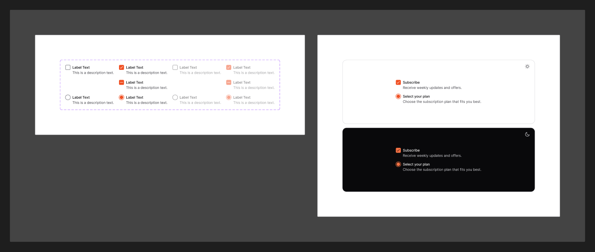

# Checkbox

[← Components](./README.md) · Code: [`@mijn-ui/react-checkbox`](../../packages/components/checkbox) (+ [`react-radio-group`](../../packages/components/radio-group))

A control for binary or multi-select choices.



## Figma variants

| Property | Values |
|----------|--------|
| `Type` | `Check`, `Indeterminate`, `Radio` |
| `isChecked` | `false`, `true` |
| `isEnabled` | `false`, `true` |

- **`Type=Check`** — standard checkbox (checkmark when checked).
- **`Type=Indeterminate`** — partial state (dash), for "some children selected".
- **`Type=Radio`** — single-select radio appearance. In code this lives in the
  separate [`@mijn-ui/react-radio-group`](../../packages/components/radio-group)
  package.
- **`isEnabled=false`** → disabled, dimmed.

## Anatomy (code)

```tsx
import { Checkbox } from "@mijn-ui/react-checkbox"

<Checkbox checked={value} onCheckedChange={setValue} />
<Checkbox checked="indeterminate" />

// Radio appearance → radio-group package
import { RadioGroup, RadioGroupItem } from "@mijn-ui/react-radio-group"
```

Exposed types: `CheckboxProps`, `CheckboxVariantProps`, `CheckboxSlots`. The
`indeterminate` value maps to Figma `Type=Indeterminate`; `Radio` maps to the
radio-group component.
