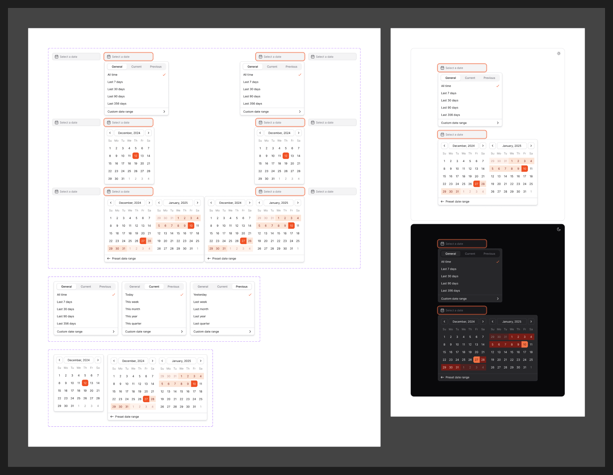

# Date Picker

[← Components](./README.md) · Code: _composed from [`react-calendar`](../../packages/components/calendar) + [`react-popover`](../../packages/components/popover)_

A trigger that opens a [Calendar](./calendar.md) in a popover to pick a date or
range.



## Figma variants

| Property | Values |
|----------|--------|
| `Type` | `Single Calendar`, `Double Calender`, `Custom Date Range`, `Preset` |
| `Active` | `General`, `Current`, `Previous` |
| `Alignment` | `Left`, `Right` |
| `isOpened` | `false`, `true` |

- **`Type`** — picker layouts: one calendar, two side-by-side calendars (for
  ranges), a custom range with inputs, or a preset list ("Last 7 days", etc.).
  _(Figma label "Double Calender" is a typo for "Double Calendar".)_
- **`Active`** — which month is in focus: `Current`, `Previous`, or general.
- **`Alignment`** — popover alignment relative to the trigger.
- **`isOpened`** — popover open/closed.

## Status

No dedicated `date-picker` package — compose it:

```tsx
import { Popover, PopoverTrigger, PopoverContent } from "@mijn-ui/react-popover"
import { Calendar } from "@mijn-ui/react-calendar"

<Popover>
  <PopoverTrigger>{/* date input / button */}</PopoverTrigger>
  <PopoverContent align="start">
    <Calendar mode="range" />
  </PopoverContent>
</Popover>
```

Use `align="start"` / `"end"` for the `Left` / `Right` alignment variants and
two `Calendar` instances for `Double Calendar`.
