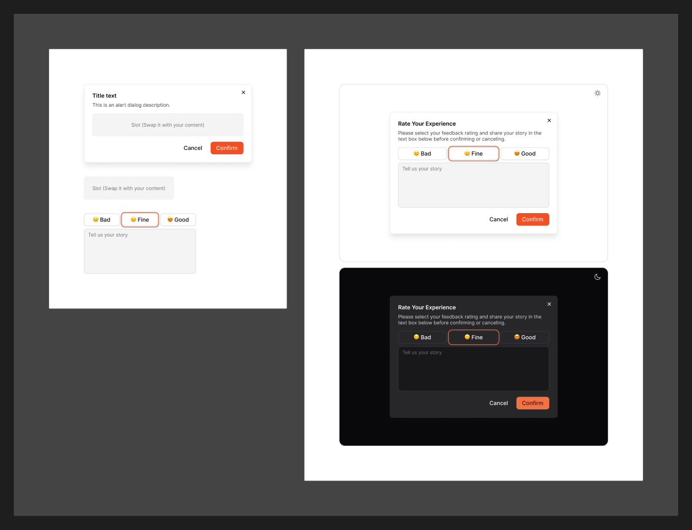

# Dialog

[← Components](./README.md) · Code: [`@mijn-ui/react-dialog`](../../packages/components/dialog)

A modal overlay for focused tasks or confirmations.



## Figma

The Dialog section documents **layout and anatomy** rather than a variant
matrix — header (title + description), body, and footer (actions), over a scrim
overlay.

## Anatomy (code)

Compound component built on Radix Dialog:

```tsx
import {
  Dialog, DialogTrigger, DialogOverlay, DialogContent,
  DialogTitle, DialogDescription, DialogFooter, DialogClose,
} from "@mijn-ui/react-dialog"

<Dialog>
  <DialogTrigger>Open</DialogTrigger>
  <DialogContent>
    <DialogTitle>Title</DialogTitle>
    <DialogDescription>Supporting text.</DialogDescription>
    {/* body */}
    <DialogFooter>
      <DialogClose>Cancel</DialogClose>
      <Button variant="brand">Confirm</Button>
    </DialogFooter>
  </DialogContent>
</Dialog>
```

Exposed types: `DialogProps`, `DialogTriggerProps`, `DialogCloseProps`,
`DialogOverlayProps`, `DialogContentProps`, `DialogTitleProps`,
`DialogDescriptionProps`, `DialogFooterProps`, `DialogVariantProps`,
`DialogSlots`.

- **Overlay** uses a black alpha scrim (see `black/*` alpha ramp in
  [Colors](../foundation/colors.md)).
- **Content** uses `shadow-2xl` ([Shadow](../foundation/shadow.md)) and
  `radius/lg`, with `--animate-dialog-open` / `-close` enter/exit transitions.
- For confirmation-style dialogs, also see the
  [`react-alert-dialog`](../../packages/components/alert-dialog) package.
