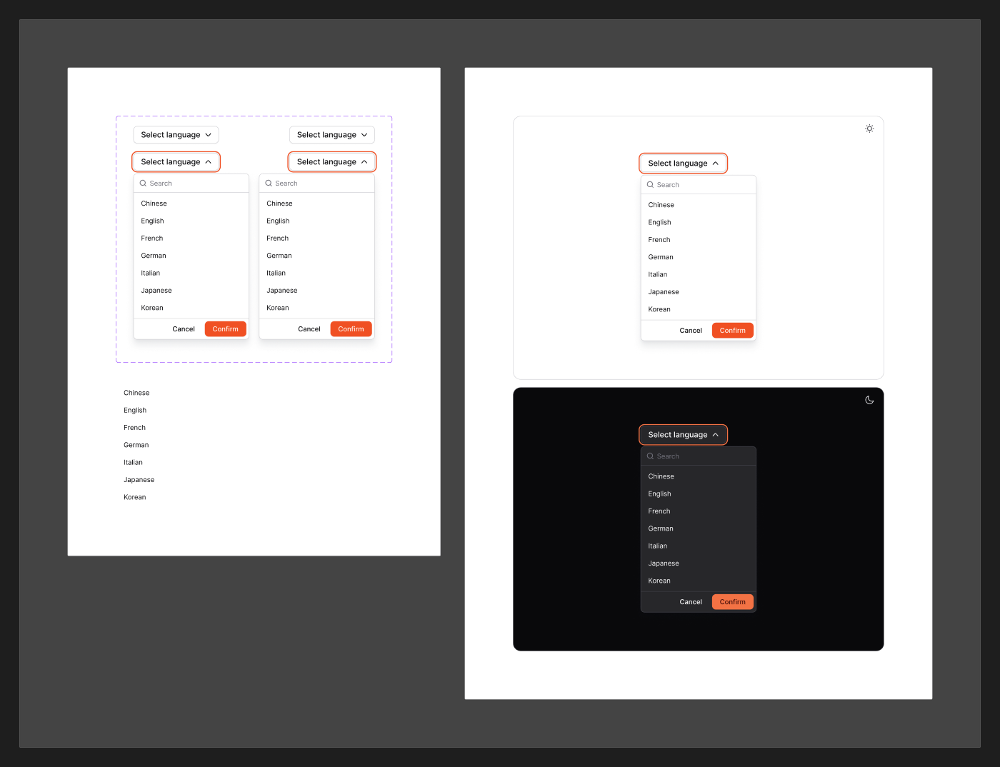

# Dropdown

[← Components](./README.md) · Code: [`@mijn-ui/react-dropdown-menu`](../../packages/components/dropdown-menu)

A menu of actions triggered by a button, opening in a popover.



## Figma variants

| Property | Values |
|----------|--------|
| `Alignment` | `Left`, `Right` |
| `isOpened` | `false`, `true` |

- **`Alignment`** — menu alignment relative to the trigger (`align="start"` /
  `"end"` in code).
- **`isOpened`** — open/closed (enter/exit uses the popover animation tokens).

Menu rows follow the [Row Item](./row-item.md) spec.

## Anatomy (code)

Compound component on Radix Dropdown Menu:

```tsx
import {
  DropdownMenu, DropdownTrigger, DropdownMenuContent, DropdownMenuItem,
  DropdownMenuCheckboxItem, DropdownMenuRadioItem,
  DropdownMenuSeparator, DropdownMenuSubTrigger, DropdownMenuSubContent,
} from "@mijn-ui/react-dropdown-menu"

<DropdownMenu>
  <DropdownTrigger>Options</DropdownTrigger>
  <DropdownMenuContent align="start">
    <DropdownMenuItem>Edit</DropdownMenuItem>
    <DropdownMenuCheckboxItem checked>Show grid</DropdownMenuCheckboxItem>
    <DropdownMenuSeparator />
    <DropdownMenuItem>Delete</DropdownMenuItem>
  </DropdownMenuContent>
</DropdownMenu>
```

Exposed types include `DropdownMenuProps`, `DropdownTriggerProps`,
`DropdownMenuContentProps`, `DropdownMenuItemProps`,
`DropdownMenuCheckboxItemProps`, `DropdownMenuRadioItemProps`,
`DropdownMenuSubTriggerProps`, `DropdownMenuSubContentProps`,
`DropdownMenuSeparatorProps`, plus `DropdownMenuVariantProps` / `DropdownMenuSlots`.

Supports nested submenus (`Sub*`), checkbox/radio items, and separators.
