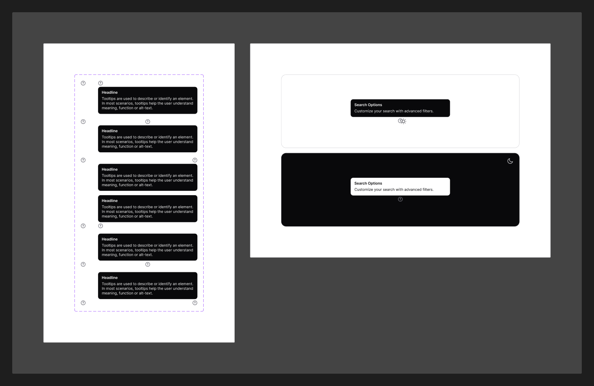

# Helper Tooltip

[← Components](./README.md) · Code: _composed from [`react-popover`](../../packages/components/popover)_

A small floating hint anchored to an element, used to explain a control.

## Figma variants

| Property | Values |
|----------|--------|
| `Align` | `Top Left`, `Top Center`, `Top Right`, `Bottom Left`, `Bottom Center`, `Bottom Right` |
| `isOpen` | `false`, `true` |

- **`Align`** — six anchor positions (top/bottom × left/center/right). The arrow
  points back to the trigger.
- **`isOpen`** — show/hide.

## Status

There is **no dedicated tooltip package** in
[`packages/components/`](../../packages/components/). Build it with the
[`react-popover`](../../packages/components/popover) package (or a Radix Tooltip),
mapping `Align` to `side` + `align`:

| Figma `Align` | `side` | `align` |
|---------------|--------|---------|
| Top Left / Center / Right | `top` | `start` / `center` / `end` |
| Bottom Left / Center / Right | `bottom` | `start` / `center` / `end` |

Styling: small `text-xs`/`text-sm` label ([Typography](../foundation/typography.md)),
`shadow-md`/`lg`, `radius/base`, on `bg/inverse` or `bg/primary`.
