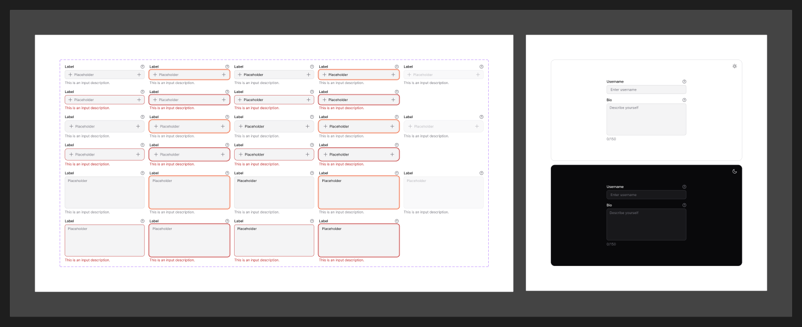

# Input

[← Components](./README.md) · Code: [`@mijn-ui/react-input`](../../packages/components/input)

A text field for single- or multi-line entry.



## Figma variants

| Property | Values |
|----------|--------|
| `Type` | `Single Line`, `Multi Lines` |
| `Size` | `Default`, `Large` |
| `isError` | `false`, `true` |
| `State` | `Enabled`, `Filling`, `Filled`, `Focused`, `Disabled` |

- **`Type`** — `Single Line` is the input; `Multi Lines` is a textarea (see the
  [`react-textarea`](../../packages/components/textarea) package).
- **`Size`** → `size` prop (`default` / `lg`).
- **`isError`** — error styling: `danger` outline + message
  ([Colors](../foundation/colors.md)).
- **`State`** — runtime lifecycle: empty (`Enabled`), typing (`Filling`),
  has value (`Filled`), `Focused` (shows the
  [focus ring](../foundation/focus-ring.md)), and `Disabled`.

## Anatomy (code)

```tsx
import { Input } from "@mijn-ui/react-input"

<Input placeholder="Email" size="default" />
<Input aria-invalid />            {/* error */}
<Input disabled />
```

Exposed types: `InputProps`, `InputBaseProps`, `InputVariantProps`, `InputSlots`.

- **`Size`** → `size` prop; **`isError`** → invalid styling; focus uses the
  brand [focus ring](../foundation/focus-ring.md).
- For multi-line, use [`react-textarea`](../../packages/components/textarea).
