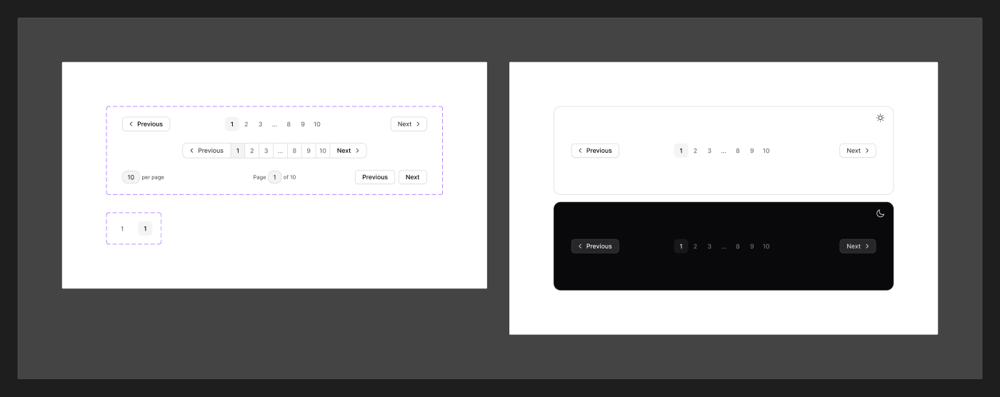

# Pagination

[← Components](./README.md) · Code: [`@mijn-ui/react-pagination`](../../packages/components/pagination)

Navigation across pages of content.



## Figma variants

| Property | Values |
|----------|--------|
| `Type` | `Classic`, `Advanced`, `Control Group` |
| `State` | `Default`, `Active/Hovered` |

- **`Type`**:
  - `Classic` — numbered page buttons with prev/next.
  - `Advanced` — numbers with ellipsis truncation for large page counts.
  - `Control Group` — compact prev/next (and optionally page indicator) only.
- **`State`** — `Active/Hovered` highlights the current page and hover targets.

## Anatomy (code)

```tsx
import {
  Pagination, PaginationContent, PaginationList,
  PaginationNextButton, PaginationNextEllipsis,
} from "@mijn-ui/react-pagination"

<Pagination total={120} pageSize={10} page={page} onPageChange={setPage}>
  <PaginationContent>
    <PaginationList />
    <PaginationNextButton />
  </PaginationContent>
</Pagination>
```

Exposed types: `PaginationProps`, `PaginationContentProps`,
`PaginationListProps`, `PaginationNextButtonProps`,
`PaginationNextEllipsisProps`, `PaginationVariantProps`, `PaginationSlots`.

The `PaginationNextEllipsis` part renders the truncation used by the `Advanced`
type. Page buttons reuse [Button](./button.md) styling.
