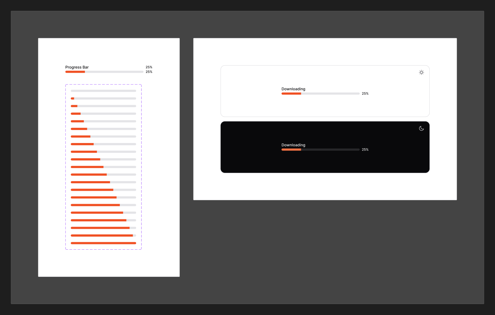

# Progress

[← Components](./README.md) · Code: [`@mijn-ui/react-progress`](../../packages/components/progress)

A horizontal bar showing completion of a task.



## Figma variants

| Property | Values |
|----------|--------|
| `Percent` | `0%`, `5%`, `10%`, `15%`, … `95%`, `100%` (5% steps) |

The Figma set documents the fill at every 5% increment from 0 to 100 — the value
is the only variant.

## Anatomy (code)

```tsx
import { Progress } from "@mijn-ui/react-progress"

<Progress value={40} />        {/* 40% filled */}
<Progress value={100} />
```

Exposed types: `ProgressProps`, `ProgressVariantProps`, `ProgressSlots`.

- **`value`** (0–100) drives the fill width — the runtime equivalent of the
  Figma `Percent` variant.
- Track uses `bg/secondary`, fill uses `bg/brand`
  ([Colors](../foundation/colors.md)); bar is fully rounded (`radius/full`).
