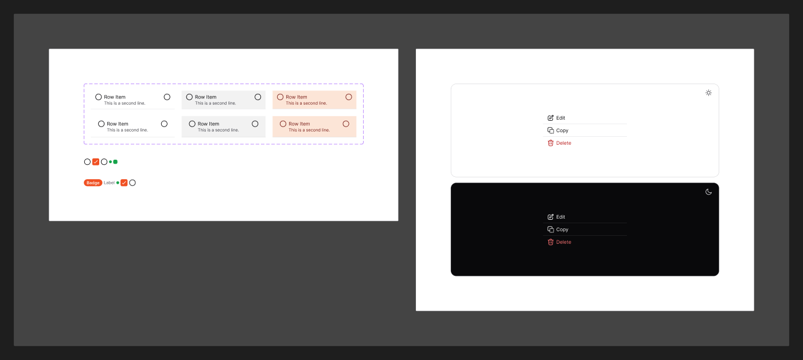

# Row Item

[← Components](./README.md) · Code: _no standalone package — used by menus/lists_

A single selectable row, used inside menus, dropdowns, lists, and command
palettes.

## Figma variants

| Property | Values |
|----------|--------|
| `Size` | `Default`, `Large` |
| `State` | `Default`, `Hovered`, `Active` |

- **`Size`** — row height/padding (`Large` for touch-friendly lists).
- **`State`** — `Hovered` (pointer/keyboard highlight) and `Active`
  (selected/pressed).

A row typically holds: optional leading icon, label, optional trailing content
(shortcut, checkmark, chevron).

## Status

Row Item is a **shared building block** rather than its own package. It surfaces
in code as the item parts of other components:

- [`DropdownMenuItem`](./dropdown.md) in `@mijn-ui/react-dropdown-menu`
- Items in [`react-command`](../../packages/components/command) and
  [`react-select`](../../packages/components/select)

Styling: `text-sm` ([Typography](../foundation/typography.md)),
`text-fg-primary`, hover background `bg/secondary`, `radius/base`.
