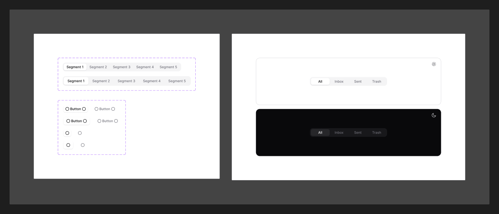

# Segmented Control

[← Components](./README.md) · Code: _no dedicated package — ≈ [`react-tabs`](../../packages/components/tabs)_

A row of mutually-exclusive options sharing one track — a compact toggle between
a few views or modes.



## Figma variants

| Property | Values |
|----------|--------|
| `Size` | `Default`, `Large` |
| `isActive` | `false`, `true` |
| `Only Icon` | `false`, `true` |

- **`Size`** — control height/padding.
- **`isActive`** — the selected segment (raised/filled indicator on the track).
- **`Only Icon`** — icon-only segments (no text label).

## Status

No standalone segmented-control package. The closest in code is
[`@mijn-ui/react-tabs`](./tab.md), which provides the same
single-select-from-a-row behaviour:

```tsx
import { Tabs, TabsList, TabsTrigger, TabsContent } from "@mijn-ui/react-tabs"

<Tabs defaultValue="list">
  <TabsList>
    <TabsTrigger value="list">List</TabsTrigger>
    <TabsTrigger value="grid">Grid</TabsTrigger>
  </TabsList>
</Tabs>
```

Style the `TabsList` as a filled track (`bg/secondary`, `radius/base`) and the
active `TabsTrigger` as a raised pill (`bg/primary` + `shadow-xs`) to match the
Segmented Control look.
