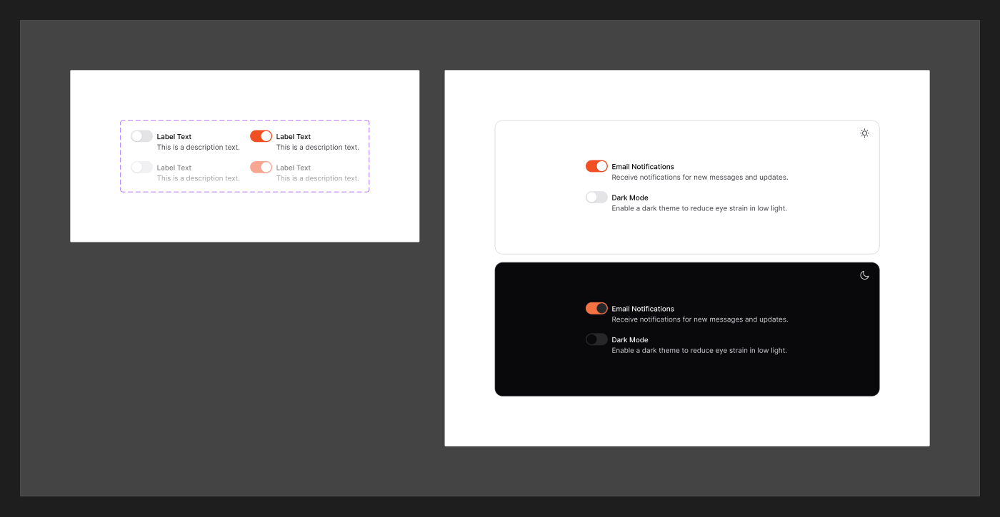

# Switch

[← Components](./README.md) · Code: [`@mijn-ui/react-switch`](../../packages/components/switch)

A toggle for an on/off setting.



## Figma variants

| Property | Values |
|----------|--------|
| `isOn` | `false`, `true` |
| `isEnabled` | `false`, `true` |

- **`isOn`** — checked state; the thumb slides and the track fills `bg/brand`.
- **`isEnabled=false`** — disabled, dimmed and non-interactive.

## Anatomy (code)

```tsx
import { Switch } from "@mijn-ui/react-switch"

<Switch checked={value} onCheckedChange={setValue} />
<Switch disabled />
```

Exposed types: `SwitchProps`, `SwitchVariantProps`, `SwitchSlots`.

- **`checked`** ↔ Figma `isOn`; **`disabled`** ↔ `isEnabled=false`.
- Off track uses `bg/secondary`, on track uses `bg/brand`, thumb is a white
  circle (`radius/full`). Focus shows the
  [focus ring](../foundation/focus-ring.md).
