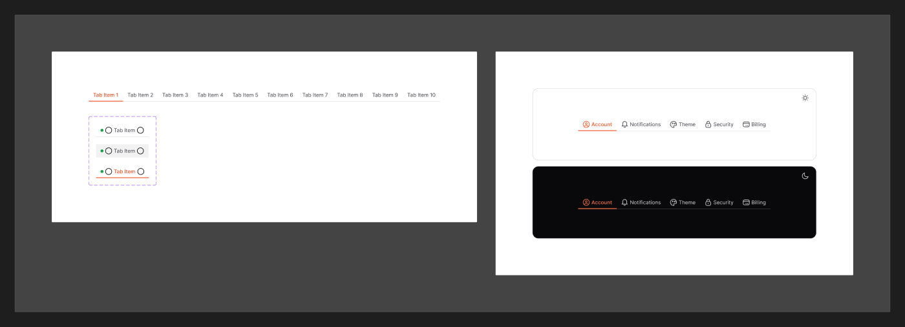

# Tab

[← Components](./README.md) · Code: [`@mijn-ui/react-tabs`](../../packages/components/tabs)

Switch between related panels of content within the same context.



## Figma variants

| Property | Values |
|----------|--------|
| `State` | `Default`, `Hovered`, `Active` |

Applies per tab trigger: `Default` (inactive), `Hovered`, and `Active` (selected,
with the active indicator/underline).

## Anatomy (code)

Compound component on Radix Tabs:

```tsx
import { Tabs, TabsList, TabsTrigger, TabsContent } from "@mijn-ui/react-tabs"

<Tabs defaultValue="overview">
  <TabsList>
    <TabsTrigger value="overview">Overview</TabsTrigger>
    <TabsTrigger value="activity">Activity</TabsTrigger>
  </TabsList>
  <TabsContent value="overview">…</TabsContent>
  <TabsContent value="activity">…</TabsContent>
</Tabs>
```

Exposed types: `TabsProps`, `TabsListProps`, `TabsTriggerProps`,
`TabsContentProps`, `TabsVariantProps`, `TabsSlots`.

- Active trigger uses `text-fg-primary` + an indicator; inactive uses
  `text-fg-secondary`. Focus shows the
  [focus ring](../foundation/focus-ring.md).
- For a track-style toggle, see [Segmented Control](./segmented-control.md).
