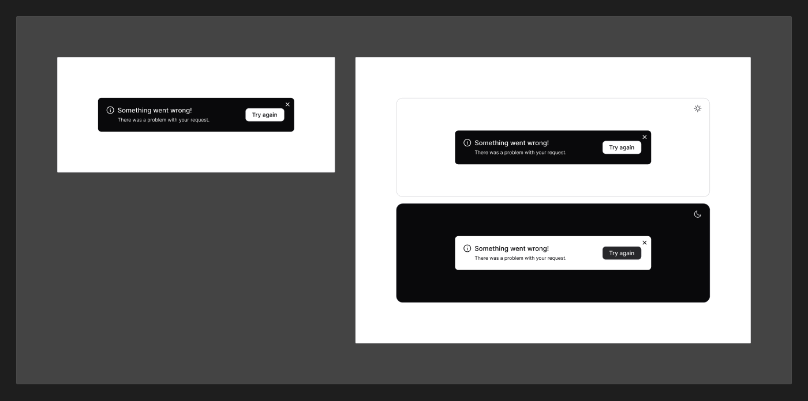

# Toast

[← Components](./README.md) · Code: _no dedicated package in this repo_

A transient notification that appears, communicates a result, and auto-dismisses.

## Figma

The Toast section documents the **anatomy** (no variant matrix): an optional
leading icon, a title + optional description, an optional action, and a close
control — on an elevated surface.

## Status

There is **no `@mijn-ui/react-toast` package** in
[`packages/components/`](../../packages/components/). Until one exists, build
toasts from primitives or a headless toaster, following the design:

- Surface: `bg/primary` (or `bg/inverse` for high-contrast), `radius/lg`,
  `shadow-lg`/`xl` ([Shadow](../foundation/shadow.md))
- Status accent: contextual color role per intent — `success` / `warning` /
  `danger` / `brand` ([Colors](../foundation/colors.md))
- Title `text-sm` semi-bold, description `text-sm` regular
  ([Typography](../foundation/typography.md))
- Close affordance: `multiplication-sign` icon
  ([Iconography](../foundation/iconography.md))

> If a toast package is added later, update this page with its anatomy and API.
