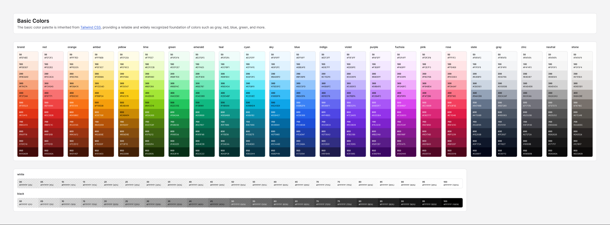
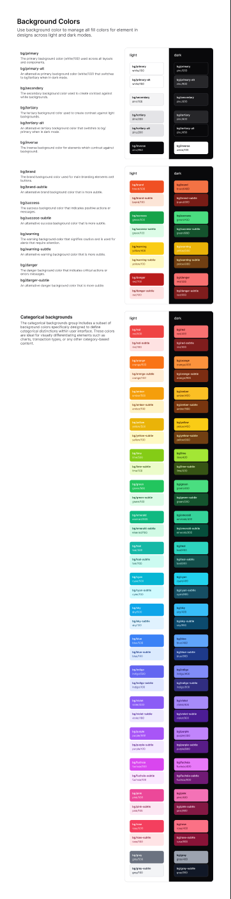
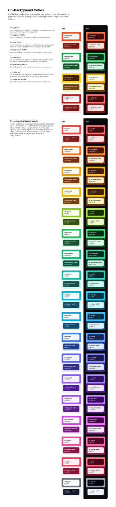
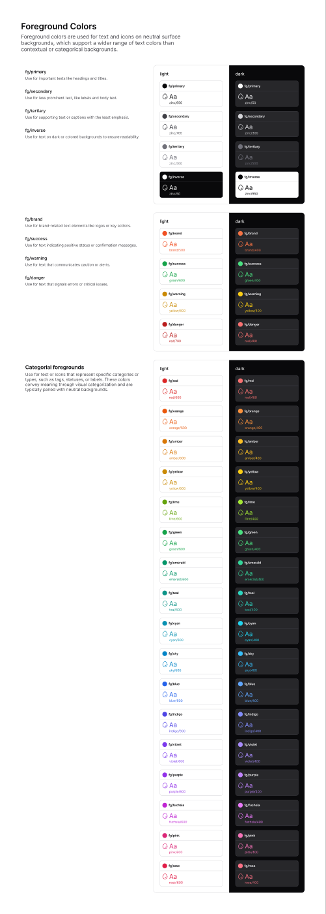
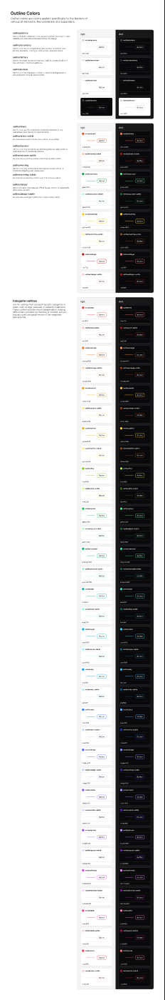

# Colors

[← Foundation](./README.md)

The color system has two layers:

1. **Primitive palette** — raw, named color ramps (brand + the full Tailwind
   palette + alpha black/white). These are the source values.
2. **Semantic roles** — purpose-named tokens (`bg`, `on-bg`, `fg`, `outline`)
   that reference primitives and flip between light and dark mode. **Always
   build with semantic roles, not primitives.**

Hex values below come from the Figma variables; the paired HSL values come from
[`theme.css`](../../packages/core/src/theme.css) (the runtime source of truth,
including dark mode).

---

## 1. Primitive palette



### Brand

The brand ramp is a custom orange. `brand/500` (`#f05023`) is the primary brand color.

| Token | Hex | | Token | Hex |
|-------|-----|-|-------|-----|
| `brand/50`  | `#fef4ee` | | `brand/500` | `#f05023` |
| `brand/100` | `#fde5d7` | | `brand/600` | `#e13415` |
| `brand/200` | `#fbc8ad` | | `brand/700` | `#bb2413` |
| `brand/300` | `#f7a27a` | | `brand/800` | `#941f18` |
| `brand/400` | `#f37244` | | `brand/900` | `#781c16` |
| | | | `brand/950` | `#410a09` |

### Tailwind palette

The remaining primitives are inherited 1:1 from Tailwind CSS, each as a
`50 → 950` ramp:

- **Reds/oranges:** `red`, `orange`, `amber`, `yellow`
- **Greens:** `lime`, `green`, `emerald`, `teal`
- **Blues:** `cyan`, `sky`, `blue`, `indigo`
- **Purples/pinks:** `violet`, `purple`, `fuchsia`, `pink`, `rose`
- **Neutrals:** `slate`, `gray`, `zinc`, `neutral`, `stone`

> Mijn UI's neutral of choice is **`zinc`** — e.g. `fg/primary` = `zinc/950`
> (`#09090b`), `outline/primary` = `zinc/300` (`#d4d4d8`).

### Alpha (transparency) ramps

`white` and `black` also ship as **alpha ramps** in 5% steps, useful for
overlays, scrims, and hover layers:

| Token | Value | | Token | Value |
|-------|-------|-|-------|-------|
| `white/00` | `#ffffff00` | | `black/00` | `#00000000` |
| `white/05` | `#ffffff0d` | | `black/05` | `#0000000d` |
| `white/10` | `#ffffff1a` | | `black/10` | `#0000001a` |
| … (every 5%) … | | | … (every 5%) … | |
| `white/95` | `#fffffff2` | | `black/95` | `#000000f2` |
| `white/100` | `#ffffff` | | `black/100` | `#000000` |

---

## 2. Background colors

> Use background color to manage all fill colors for elements across light and
> dark modes.



### Neutral surfaces

| Figma token | Light hex | Code token | Dark (HSL) |
|-------------|-----------|------------|------------|
| `bg/primary`       | `#ffffff` | `--color-bg-default`       | `hsl(240 10% 4%)` |
| `bg/primary-alt`   | `#ffffff` | `--color-bg-default-alt`   | `hsl(240 4% 16%)` |
| `bg/secondary`     | `#f4f4f5` | `--color-bg-secondary`     | `hsl(240 6% 10%)` |
| `bg/tertiary`      | `#e4e4e7` | `--color-bg-tertiary`      | `hsl(240 4% 16%)` |
| `bg/tertiary-alt`  | `#e4e4e7` | `--color-bg-tertiary-alt`  | `hsl(240 10% 4%)` |
| `bg/inverse`       | `#09090b` | `--color-bg-inverse`       | `hsl(0 0 100%)` |

> The code also defines an `accent` surface (`--color-bg-accent`) that is not
> shown as a separate Figma swatch.

### Contextual surfaces

Each role has a solid and a `-subtle` variant:

| Role | `bg/*` | `bg/*-subtle` |
|------|--------|----------------|
| brand   | `#f05023` | `#fde5d7` |
| success | `#16a34a` | `#dcfce7` |
| warning | `#facc15` | `#fef9c3` |
| danger  | `#b91c1c` | `#fee2e2` |

### Categorical surfaces

For charts, tags, and category coding — every palette hue is exposed as a
`bg/<hue>` + `bg/<hue>-subtle` pair. Solid uses the `500/600` step, subtle uses
the `100/200` step:

| Hue | `bg/*` | `bg/*-subtle` | | Hue | `bg/*` | `bg/*-subtle` |
|-----|--------|----------------|-|-----|--------|----------------|
| red     | `#ef4444` | `#fee2e2` | | sky     | `#0ea5e9` | `#e0f2fe` |
| orange  | `#f97316` | `#ffedd5` | | blue    | `#3b82f6` | `#dbeafe` |
| amber   | `#f59e0b` | `#fef3c7` | | indigo  | `#6366f1` | `#e0e7ff` |
| yellow  | `#eab308` | `#fef9c3` | | violet  | `#8b5cf6` | `#ede9fe` |
| lime    | `#84cc16` | `#ecfccb` | | purple  | `#a855f7` | `#f3e8ff` |
| green   | `#22c55e` | `#dcfce7` | | fuchsia | `#d946ef` | `#fae8ff` |
| emerald | `#10b981` | `#d1fae5` | | pink    | `#ec4899` | `#fce7f3` |
| teal    | `#14b8a6` | `#ccfbf1` | | rose    | `#f43f5e` | `#ffe4e6` |
| cyan    | `#06b6d4` | `#cffafe` | | gray    | `#6b7280` | `#f3f4f6` |

---

## 3. On-background colors

> On-Background colors are foreground colors **designed to pair with a specific
> background**, guaranteeing contrast across light and dark modes. Use
> `on-bg/brand` text on a `bg/brand` surface, etc.



### Contextual

| Role | `on-bg/*` | `on-bg/*-subtle` |
|------|-----------|-------------------|
| brand   | `#fef4ee` | `#781c16` |
| success | `#f0fdf4` | `#14532d` |
| warning | `#422006` | `#713f12` |
| danger  | `#fef2f2` | `#7f1d1d` |

### Categorical

`on-bg/<hue>` (light text for solid surfaces) and `on-bg/<hue>-subtle` (dark
text for subtle surfaces):

| Hue | `on-bg/*` | `on-bg/*-subtle` | | Hue | `on-bg/*` | `on-bg/*-subtle` |
|-----|-----------|-------------------|-|-----|-----------|-------------------|
| red     | `#fef2f2` | `#7f1d1d` | | sky     | `#f0f9ff` | `#0c4a6e` |
| orange  | `#fff7ed` | `#7c2d12` | | blue    | `#eff6ff` | `#1e3a8a` |
| amber   | `#fffbeb` | `#78350f` | | indigo  | `#eef2ff` | `#312e81` |
| yellow  | `#fefce8` | `#713f12` | | violet  | `#f5f3ff` | `#4c1d95` |
| lime    | `#f7fee7` | `#365314` | | purple  | `#faf5ff` | `#581c87` |
| green   | `#f0fdf4` | `#14532d` | | fuchsia | `#fdf4ff` | `#701a75` |
| emerald | `#ecfdf5` | `#064e3b` | | pink    | `#fdf2f8` | `#831843` |
| teal    | `#f0fdfa` | `#134e4a` | | rose    | `#fff1f2` | `#881337` |
| cyan    | `#ecfeff` | `#164e63` | | gray    | `#f9fafb` | `#111827` |

---

## 4. Foreground colors

> Foreground colors are used for **text and icons on neutral surfaces**.



### Neutral text

| Figma token | Light hex | Code token | Dark (HSL) |
|-------------|-----------|------------|------------|
| `fg/primary`   | `#09090b` | `--color-fg-default`   | `hsl(0 0 100%)` |
| `fg/secondary` | `#3f3f46` | `--color-fg-secondary` | `hsl(240 5% 84%)` |
| `fg/tertiary`  | `#71717a` | `--color-fg-tertiary`  | `hsl(240 4% 46%)` |
| `fg/inverse`   | `#fafafa` | `--color-fg-inverse`   | `hsl(240 10% 4%)` |

### Contextual & categorical text

Foreground roles use a slightly darker step than the matching background so text
stays legible on neutral surfaces:

| Role | `fg/*` | | Hue | `fg/*` | | Hue | `fg/*` |
|------|--------|-|-----|--------|-|-----|--------|
| brand   | `#f05023` | | red    | `#dc2626` | | sky     | `#0284c7` |
| success | `#16a34a` | | orange | `#ea580c` | | blue    | `#2563eb` |
| warning | `#ca8a04` | | amber  | `#d97706` | | indigo  | `#4f46e5` |
| danger  | `#b91c1c` | | yellow | `#ca8a04` | | violet  | `#7c3aed` |
|         |           | | lime   | `#65a30d` | | purple  | `#9333ea` |
|         |           | | green  | `#16a34a` | | fuchsia | `#c026d3` |
|         |           | | emerald| `#059669` | | pink    | `#db2777` |
|         |           | | teal   | `#0d9488` | | rose    | `#e11d48` |
|         |           | | cyan   | `#0891b2` | |         |           |

---

## 5. Outline colors

> Outline colors apply specifically to **borders** of UI elements — containers,
> separators, inputs, focus/selection states.



### Neutral outlines

| Figma token | Light hex | Code token | Dark (HSL) |
|-------------|-----------|------------|------------|
| `outline/primary`   | `#d4d4d8` | `--color-outline-default`   | `hsl(240 5% 26%)` |
| `outline/secondary` | `#e4e4e7` | `--color-outline-secondary` | `hsl(240 4% 16%)` |
| `outline/tertiary`  | `#f4f4f5` | `--color-outline-tertiary`  | `hsl(240 6% 10%)` |
| `outline/inverse`   | `#3f3f46` | `--color-outline-inverse`   | `hsl(240 5% 84%)` |

### Contextual & categorical outlines

Solid + `-subtle` per role:

| Role | `outline/*` | `outline/*-subtle` |
|------|-------------|---------------------|
| brand   | `#f05023` | `#fbc8ad` |
| success | `#16a34a` | `#bbf7d0` |
| warning | `#facc15` | `#fef08a` |
| danger  | `#b91c1c` | `#fecaca` |

| Hue | `outline/*` | `outline/*-subtle` | | Hue | `outline/*` | `outline/*-subtle` |
|-----|-------------|---------------------|-|-----|-------------|---------------------|
| red     | `#ef4444` | `#fecaca` | | sky     | `#0ea5e9` | `#bae6fd` |
| orange  | `#f97316` | `#fed7aa` | | blue    | `#3b82f6` | `#bfdbfe` |
| amber   | `#f59e0b` | `#fde68a` | | indigo  | `#6366f1` | `#c7d2fe` |
| yellow  | `#eab308` | `#fef08a` | | violet  | `#8b5cf6` | `#ddd6fe` |
| lime    | `#84cc16` | `#d9f99d` | | purple  | `#a855f7` | `#e9d5ff` |
| green   | `#22c55e` | `#bbf7d0` | | fuchsia | `#d946ef` | `#f5d0fe` |
| emerald | `#10b981` | `#a7f3d0` | | pink    | `#ec4899` | `#fbcfe8` |
| teal    | `#14b8a6` | `#99f6e4` | | rose    | `#f43f5e` | `#fecdd3` |
| cyan    | `#06b6d4` | `#a5f3fc` | | | | |

---

## Usage

```tsx
// Semantic roles map to Tailwind utility classes generated from theme.css
<div className="bg-bg-default text-fg-default border-outline-default">
  <span className="text-fg-secondary">Subtle label</span>
  <button className="bg-bg-brand text-on-bg-brand">Primary action</button>
  <span className="bg-bg-danger-subtle text-on-bg-danger-subtle">Error</span>
</div>
```

Prefer semantic roles (`bg-bg-*`, `text-fg-*`, `text-on-bg-*`, `border-outline-*`)
so light/dark mode and theming work automatically.
