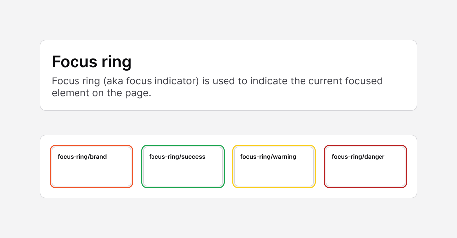

# Focus Ring

[← Foundation](./README.md)

> The focus ring (aka focus indicator) shows the **currently focused element**
> on the page. It is essential for keyboard navigation and accessibility.



## Anatomy

Each focus ring is a **two-layer shadow**:

1. A **2px gap ring** in `bg/secondary` (`#f4f4f5`) — separates the element edge
   from the colored ring so it reads cleanly against any surface.
2. A **4px colored ring** in the contextual color, drawn outside the gap.

In Figma these are drop-shadow effects with `offset (0,0)`, `radius 0`, and
`spread 2` (gap) + `spread 4` (color). In CSS they map to stacked `box-shadow`
rings.

## Variants

| Token | Ring color | Hex |
|-------|------------|-----|
| `focus-ring/brand`   | `bg/brand`   | `#f05023` |
| `focus-ring/success` | `bg/success` | `#16a34a` |
| `focus-ring/warning` | `bg/warning` | `#facc15` |
| `focus-ring/danger`  | `bg/danger`  | `#b91c1c` |

> The Figma layer labels read `foucs-ring/*` (a typo for `focus-ring/*`).

## Usage

Stack two rings — the gap first, then the color:

```tsx
// Brand focus ring on keyboard focus
<button
  className="rounded-base focus-visible:outline-none
             focus-visible:shadow-[0_0_0_2px_var(--color-bg-secondary),0_0_0_4px_var(--color-bg-brand)]"
>
  Save
</button>
```

Swap the second color for `--color-bg-success` / `--color-bg-warning` /
`--color-bg-danger` to signal the matching state. Prefer `:focus-visible` so the
ring appears for keyboard users without firing on mouse clicks.
