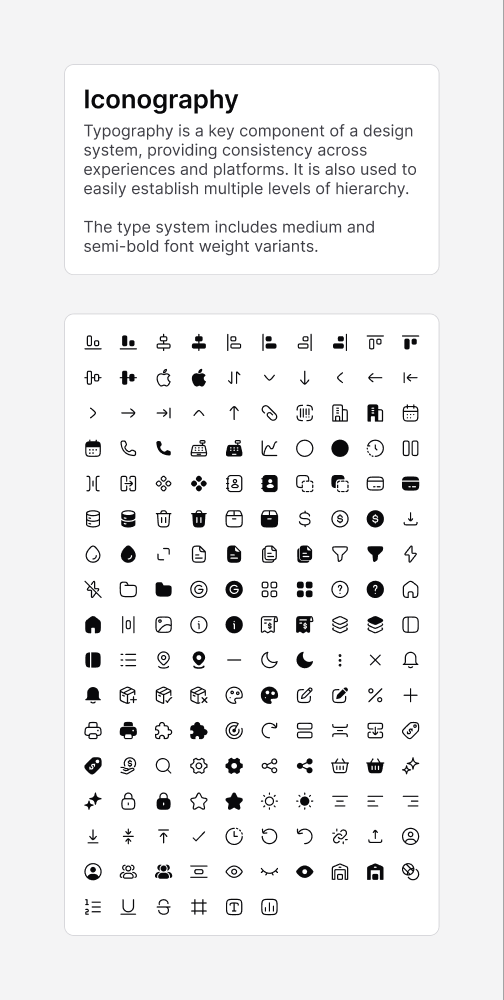

# Iconography

[← Foundation](./README.md)

> A consistent icon set supports clarity and hierarchy across the product.



## Format

| | |
|---|---|
| **Grid** | 24 × 24 px |
| **Variants** | **Stroke** (default) and **Solid** — solid icons use the `-solid` suffix |
| **Naming** | Hugeicons-style kebab-case with numbered families (e.g. `arrow-down-01`, `home-11`) |
| **Count** | ~168 symbols (stroke + solid combined) |

Many icons ship as a **stroke / solid pair** — e.g. `star` and `star-solid`.
Use stroke for resting/inactive states and solid for active/selected states.

## Icons by category

### Arrows & navigation
`arrow-up-01` · `arrow-up-02` · `arrow-down-01` · `arrow-down-02` ·
`arrow-left-01` · `arrow-left-02` · `arrow-left-03` · `arrow-right-01` ·
`arrow-right-02` · `arrow-right-03` · `arrow-data-transfer-vertical` ·
`expand` · `redo-02` · `undo` · `undo-02`

### Alignment & layout
`align-top` · `align-bottom` · `align-left` · `align-right` ·
`align-horizontal-center` · `align-vertical-center` · `column` · `column-gap` ·
`column-span` · `row` · `row-gap` · `row-span` · `grid` · `grid-view` ·
`layout-left` · `horizontal-padding` · `vertical-padding`
_(alignment icons also have `-solid` variants)_

### Text formatting
`text-align-left` · `text-align-center` · `text-align-right` ·
`text-vertical-top` · `text-vertical-center` · `text-vertical-bottom` ·
`text-underline` · `text-strikethrough` · `text-square` ·
`left-to-right-list-dash` · `left-to-right-list-number`

### Actions & UI controls
`search-01` · `filter` · `settings-02` · `more-vertical` · `plus-sign` ·
`minus-sign` · `multiplication-sign` · `tick-02` · `delete-02` · `download-04` ·
`upload-01` · `copy-02` · `view` · `view-off` · `pencil-edit-02` ·
`square-lock-02` · `unlink-04` · `transparency` · `help-circle` ·
`information-circle` · `notification-02` · `share-08`

### Commerce & logistics
`dollar-01` · `dollar-circle` · `credit-card` · `sale-tag-02` ·
`shopping-basket-03` · `cashier-02` · `invoice-03` · `save-money-dollar` ·
`bar-code-scan` · `percent` · `package-add` · `package-delivered` ·
`package-remove` · `delivery-box-01` · `warehouse`

### Files, data & objects
`file-02` · `files-01` · `folder-01` · `database` · `layers-01` · `component` ·
`puzzle` · `image-01` · `attachment-01` · `analytics-01` · `chart-line-data-01` ·
`printer` · `paint-board`

### People & places
`user-circle-02` · `user-group-03` · `contact-01` · `home-11` · `building-06` ·
`location-05` · `radar-03`

### Time
`calendar-03` · `clock-04` · `time-quarter-02`

### Weather, theme & misc
`sun-03` · `moon-02` · `flash` · `flash-off` · `droplet` · `sparkles` · `star` ·
`circle`

### Brand
`apple` · `google`

## Usage

Reference icons by name from the icon library used in your app (the set follows
Hugeicons naming). Pick the stroke variant by default and the `-solid` variant
for active/selected states:

```tsx
<Icon name="star" />        {/* inactive */}
<Icon name="star-solid" />  {/* active / favorited */}
```
