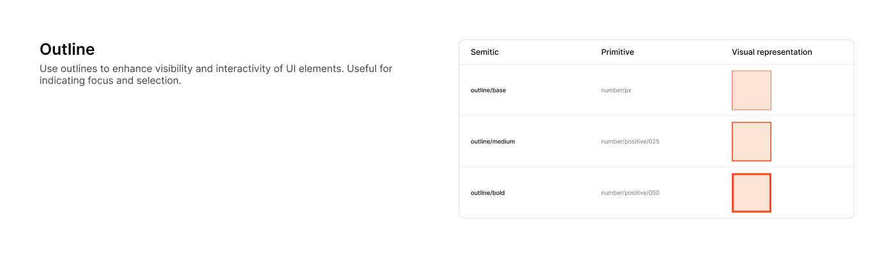

# Outline

[← Foundation](./README.md)

> Use outlines to enhance the visibility and interactivity of UI elements.
> Useful for indicating focus and selection, and for the borders of containers,
> inputs, and separators.



This page covers outline **width**. For outline **colors** (`outline/primary`,
`outline/brand`, etc.) see [Colors → Outline colors](./colors.md#5-outline-colors).

## Width scale

| Figma token | Maps to | Value |
|-------------|---------|-------|
| `outline/base`   | `number/px`           | 1px (default border) |
| `outline/medium` | `number/positive/025` | 2px |
| `outline/bold`   | `number/positive/050` | 4px |

- **`base` (1px)** — default for borders, dividers, inputs, and cards.
- **`medium` (2px)** — emphasized borders and selected states.
- **`bold` (4px)** — strong emphasis; also the width of the colored
  [focus ring](./focus-ring.md).

## Usage

```tsx
<div className="border border-outline-default">1px hairline</div>
<div className="border-2 border-outline-brand">2px selected</div>
```

Pair an outline width with an [outline color](./colors.md#5-outline-colors):
`border-outline-default` at rest, a contextual color
(`border-outline-brand` / `-success` / `-warning` / `-danger`) for state.
