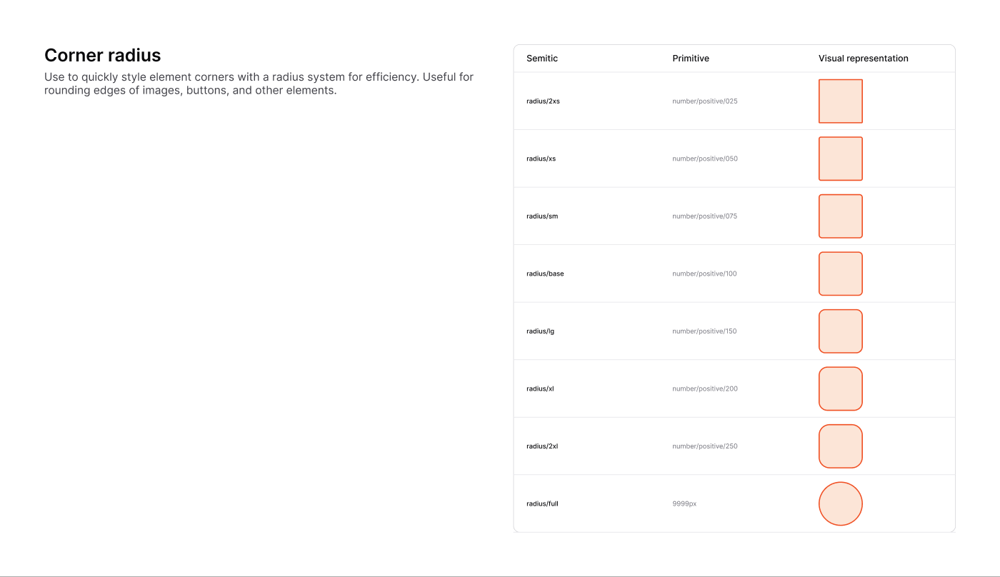

# Corner Radius

[← Foundation](./README.md)

> Use the radius system to quickly and consistently round element corners —
> images, buttons, inputs, cards, and other containers.



## Scale

Values match [`theme.css`](../../packages/core/src/theme.css) exactly. `base`
(8px) is the default for most surfaces.

| Figma token | CSS variable | rem | px |
|-------------|--------------|-----|-----|
| `radius/2xs`  | `--radius-2xs`  | `0.125rem` | 2px |
| `radius/xs`   | `--radius-xs`   | `0.25rem`  | 4px |
| `radius/sm`   | `--radius-sm`   | `0.375rem` | 6px |
| `radius/base` | `--radius-base` | `0.5rem`   | **8px** |
| `radius/lg`   | `--radius-lg`   | `0.75rem`  | 12px |
| `radius/xl`   | `--radius-xl`   | `1rem`     | 16px |
| `radius/2xl`  | `--radius-2xl`  | `1.25rem`  | 20px |
| `radius/full` | `--radius-full` | —          | 9999px (pill / circle) |

## Usage

```tsx
<div className="rounded-base">Card (8px)</div>
<div className="rounded-lg">Dialog / panel (12px)</div>
<span className="rounded-full">Avatar / pill</span>
```

`radius/full` (9999px) fully rounds an element — pills for badges, circles for
avatars and icon buttons.
