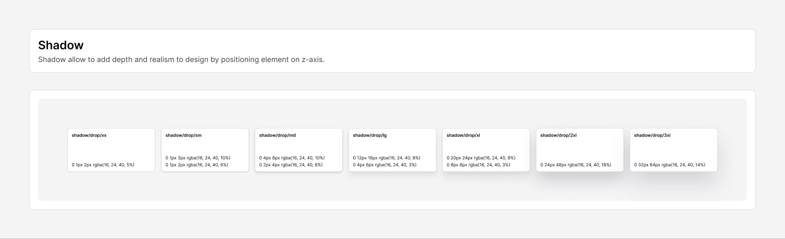

# Shadow

[← Foundation](./README.md)

> Shadows add depth and realism by positioning elements on the z-axis. Use a
> larger shadow to lift an element further off the surface.



## Elevation scale

All shadows share the same shadow color (`rgba(16, 24, 40, …)` — a deep slate)
and grow in offset, blur, and opacity as elevation increases. Values match
[`theme.css`](../../packages/core/src/theme.css) exactly.

| Figma token | CSS variable | Value |
|-------------|--------------|-------|
| `shadow/drop/xs`  | `--shadow-xs`  | `0 1px 2px rgba(16,24,40,0.05)` |
| `shadow/drop/sm`  | `--shadow-sm`  | `0 1px 3px rgba(16,24,40,0.1)`, `0 1px 2px rgba(16,24,40,0.06)` |
| `shadow/drop/md`  | `--shadow-md`  | `0 4px 8px rgba(16,24,40,0.1)`, `0 2px 4px rgba(16,24,40,0.06)` |
| `shadow/drop/lg`  | `--shadow-lg`  | `0 12px 16px rgba(16,24,40,0.08)`, `0 4px 6px rgba(16,24,40,0.03)` |
| `shadow/drop/xl`  | `--shadow-xl`  | `0 20px 24px rgba(16,24,40,0.08)`, `0 8px 8px rgba(16,24,40,0.03)` |
| `shadow/drop/2xl` | `--shadow-2xl` | `0 24px 48px rgba(16,24,40,0.18)` |
| `shadow/drop/3xl` | `--shadow-3xl` | `0 32px 64px rgba(16,24,40,0.14)` |

> `sm` through `xl` are **two-layer** shadows (a soft ambient layer + a tighter
> contact layer); `xs`, `2xl`, and `3xl` are single-layer.

## Suggested elevation mapping

| Level | Token | Typical use |
|-------|-------|-------------|
| Flat / hairline | `xs` | Cards, inputs at rest |
| Raised | `sm` / `md` | Hovered cards, dropdowns, small popovers |
| Floating | `lg` / `xl` | Popovers, menus, tooltips |
| Overlay | `2xl` / `3xl` | Dialogs, modals, command palette |

## Usage

```tsx
<div className="shadow-xs rounded-base">Resting card</div>
<div className="shadow-lg rounded-lg">Popover</div>
<div className="shadow-2xl rounded-lg">Modal</div>
```
