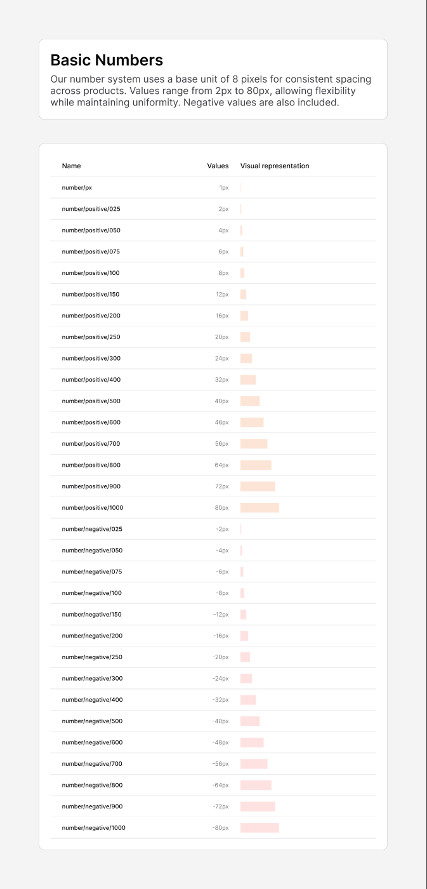

# Spacing

[← Foundation](./README.md)

> The number system uses a **base unit of 8 pixels** for consistent spacing
> across products. Values range from 2px to 80px, allowing flexibility while
> maintaining uniformity. **Negative values are also included.**

Use these in place of raw pixel values for margins, padding, and gaps between
components.

## Two naming schemes

The same scale carries **two names** in the file — a numeric name shown in the
spacing table (`number/positive/100`) and a t-shirt name used by the spacing
variable (`space/positive/base`). Both refer to the same pixel value.

| Numeric name | T-shirt token | Value |
|--------------|---------------|-------|
| `number/px`            | —                    | 1px |
| `number/positive/025`  | `space/positive/2xs` | 2px |
| `number/positive/050`  | `space/positive/xs`  | 4px |
| `number/positive/075`  | `space/positive/sm`  | 6px |
| `number/positive/100`  | `space/positive/base`| **8px** (base unit) |
| `number/positive/150`  | `space/positive/lg`  | 12px |
| `number/positive/200`  | `space/positive/xl`  | 16px |
| `number/positive/250`  | `space/positive/2xl` | 20px |
| `number/positive/300`  | `space/positive/3xl` | 24px |
| `number/positive/400`  | `space/positive/4xl` | 32px |
| `number/positive/500`  | `space/positive/5xl` | 40px |
| `number/positive/600`  | `space/positive/6xl` | 48px |
| `number/positive/700`  | `space/positive/7xl` | 56px |
| `number/positive/800`  | `space/positive/8xl` | 64px |
| `number/positive/900`  | `space/positive/9xl` | 72px |
| `number/positive/1000` | `space/positive/10xl`| 80px |

## Negative scale

Every positive value has a negative counterpart (`number/negative/025` = −2px …
`number/negative/1000` = −80px), for pulling elements with negative margins /
offsets.

## Notes

- The scale is **not** a strict ×8 multiplier at the small end: 2 / 4 / 6 are
  half-steps below the 8px base, after which it steps 8 → 12 → 16 → 20 → 24,
  then by 8s up to 80.
- In code, these map onto the project's Tailwind spacing scale; prefer the
  utility classes (`p-2`, `gap-4`, `mt-6`, …) over arbitrary pixel values so
  spacing stays on-system.
