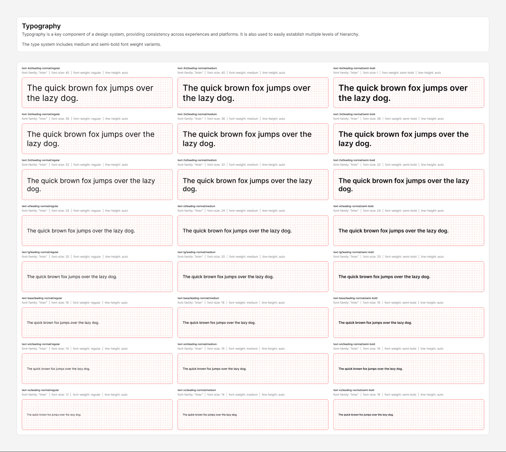

# Typography

[← Foundation](./README.md)

> Typography provides consistency across experiences and platforms and
> establishes multiple levels of hierarchy. The type system includes **medium**
> and **semi-bold** weight variants (alongside regular).



## Typeface

| | |
|---|---|
| **Family** | `Inter` |
| **Weights** | Regular (400), Medium (500), Semi Bold (600) |
| **Letter spacing** | `0` across the scale |

## Type scale

Eight sizes, named `xs → 4xl`. Each size exists in all three weights. The token
name encodes **size / line-height / weight**, e.g.
`text-base/leading-normal/medium`.

| Token size | Font size | `leading-normal` line-height | `leading-none` line-height |
|------------|-----------|------------------------------|----------------------------|
| `text-xs`   | 12px | normal (auto) | 12px |
| `text-sm`   | 14px | normal (auto) | 14px |
| `text-base` | 16px | normal (auto) | 16px |
| `text-lg`   | 20px | normal (auto) | 20px |
| `text-xl`   | 24px | normal (auto) | 24px |
| `text-2xl`  | 32px | normal (auto) | 32px |
| `text-3xl`  | 36px | normal (auto) | — |
| `text-4xl`  | 40px | normal (auto) | — |

- **`leading-normal`** — line-height set to `100` (Figma "auto") for body and
  headings that may wrap.
- **`leading-none`** — line-height equal to the font size, for single-line
  labels, buttons, and badges where tight vertical rhythm matters.

## Weights

| Weight | Figma style | CSS weight |
|--------|-------------|------------|
| Regular   | `Regular`   | 400 |
| Medium    | `Medium`    | 500 |
| Semi Bold | `Semi Bold` | 600 |

## How it's used in the file

The Foundation pages themselves apply the scale consistently:

- **Section titles** → `text-2xl` Semi Bold, `fg/primary`
- **Section descriptions** → `text-lg` Regular, `fg/secondary`
- **Token labels** → `text-xs` Semi Bold, `fg/primary`
- **Token values** → `text-xs` Regular

## Usage

```tsx
<h2 className="text-2xl font-semibold text-fg-default">Heading</h2>
<p  className="text-base text-fg-secondary">Body copy in Inter Regular.</p>
<span className="text-xs font-medium leading-none">Badge label</span>
```
